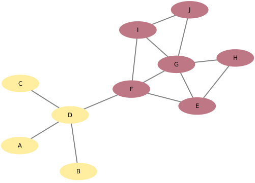

# Modelo de Apresentação da Final

# Estrutura de Arquivos e Pastas

A estrutura aqui apresentada é uma simplificação daquela proposta pelo [Cookiecutter Data Science](https://drivendata.github.io/cookiecutter-data-science/). Também será aceito que o projeto adote a estrutura completa do Cookiecutter Data Science e isso será considerado um diferencial. A estrutura geral é a seguinte e será detalhada a seguir:

~~~
├── README.md  <- arquivo apresentando a proposta
│
├── data
│   ├── external       <- dados de terceiros em formato usado para entrada na transformação
│   ├── interim        <- dados intermediários, e.g., resultado de transformação
│   ├── processed      <- dados finais usados para a publicação
│   └── raw            <- dados originais sem modificações
│
├── notebooks          <- Jupyter notebooks ou equivalentes
│
├── slides             <- arquivo de slides em formato PDF
│
├── src                <- fonte em linguagem de programação ou sistema (e.g., Orange, Cytoscape)
│   └── README.md      <- instruções básicas de instalação/execução
│
└── assets             <- mídias usadas no projeto
~~~

Na raiz deve haver um arquivo de nome `README.md` contendo a apresentação do projeto, como detalhado na seção seguinte.

## `data`

Arquivos de dados usados no projeto, quando isso ocorrer.

## `notebooks`

Testes ou prototipos relacionados ao projeto que tenham sido executados no Jupyter.

## `src`

Projeto na linguagem escolhida caso não seja usado o notebook, incluindo todos os arquivos de dados e bibliotecas necessários para a sua execução. Só coloque código Pyhton ou Java aqui se ele não rodar dentro do notebook.

 Acrescente na raiz um arquivo `README.md` com as instruções básicas de instalação e execução.

## `assets`

Qualquer mídia usada no seu projeto: vídeo, imagens, animações, slides etc. Coloque os arquivos aqui (mesmo que você mantenha uma cópia no diretório do código).

# Modelo para Apresentação da Entrega Prévia do Projeto

# Projeto Musication

# Equipe Time 7 - TIME7
* `Pedro Henrique Rodrigues de Araújo` - `223382`
* `Vitor Rodrigues Pietrobom` - `245584`
* `Leonardo Almeida Reis` - `239104`

## Resumo do Projeto
> O projeto visa verificar qual a influência da personalidade/hábitos de uma pessoa no gosto musical. Analisando essa relação, o projeto também visa prever outras músicas que determinada pessoa estaria propensa a gostar com base nas músicas que ele já tem interesse.

## Slides da Apresentação
> [Link dos Slides](https://docs.google.com/presentation/d/1r4C2AARPJPqrHkjzw1DNjytIiKkrkri_l9Ge_kmfmHE/edit?usp=sharing)

## Modelo Conceitual

> 

## Modelos Lógicos

> Modelo lógico relacional
~~~
MUSICA(_Id_, Nome, Artista, Popularidade, Explícito, TipoDeMusica)
RELACAO(_IdMusica1_, _IdMusica2_, Peso)
  _IdMusica1_ chave estrangeira -> MUSICA(_Id_)
  _IdMusica2_ chave estrangeira -> MUSICA(_Id_)
~~~

> Modelo de grafos de conhecimento
>
> Ilustração das Classes:
> 
>
> Exemplo de Instâncias:
> 

## Dataset Publicado
> Elencar os arquivos/bases preliminares dos datasets serão publicados.
> 
título do arquivo/base | link | breve descrição
----- | ----- | -----
`<título da base>` | `<link para a página da base>` | `<breve descrição da base>`

> Os arquivos finais do dataset publicado devem ser colocados na pasta `data`, em subpasta `processed`. Outros arquivos serão colocados em subpastas conforme seu papel (externo, interim, raw). A diferença entre externo e raw é que o raw é em formato não adaptado para uso. A pasta `raw` é opcional, pois pode ser substituída pelo link para a base original da seção anterior.
> Coloque arquivos que não estejam disponíveis online e sejam acessados pelo notebook. Relacionais (usualmente CSV), XML, JSON e CSV ou triplas para grafos.
> Este é o conjunto mínimo de informações que deve constar na disponibilização do Dataset, mas a equipe pode enriquecer esta seção.

## Bases de Dados

título da base | link | breve descrição
----- | ----- | -----
`musicoset_metadata.zip` | `https://marianaossilva.github.io/DSW2019/index.html` | `Dataset com algumas informações sobre as músicas. Dentre as informações úteis, temos: artistas, popularidade, conteúdo explícito, tipo de música`
`musicoset_metadata.zip` | `https://www.aicrowd.com/challenges/spotify-million-playlist-dataset-challenge` | `Dataset com um grande conjunto de playlists. Além disso informa quantas e quais músicas existem em cada playlist.`

## Detalhamento do Projeto
> Apresente aqui detalhes do processo de construção do dataset e análise. Nesta seção ou na seção de Perguntas podem aparecer destaques de código como indicado a seguir. Note que foi usada uma técnica de highlight de código, que envolve colocar o nome da linguagem na abertura de um trecho com `~~~`, tal como `~~~python`.
> Os destaques de código devem ser trechos pequenos de poucas linhas, que estejam diretamente ligados a alguma explicação. Não utilize trechos extensos de código. Se algum código funcionar online (tal como um Jupyter Notebook), aqui pode haver links. No caso do Jupyter, preferencialmente para o Binder abrindo diretamente o notebook em questão.

~~~python
df = pd.read_excel("/content/drive/My Drive/Colab Notebooks/dataset.xlsx");
sns.set(color_codes=True);
sns.distplot(df.Hemoglobin);
plt.show();
~~~

> Se usar Orange para alguma análise, você pode apresentar uma captura do workflow, como o exemplo a seguir e descrevê-lo:

> Coloque um link para o arquivo do notebook, programas ou workflows que executam as operações que você apresentar.

> Aqui devem ser apresentadas as operações de construção do dataset:
* extração de dados de fontes não estruturadas como, por exemplo, páginas Web
* agregação de dados fragmentados obtidos a partir de API
* integração de dados de múltiplas fontes
* tratamento de dados
* transformação de dados para facilitar análise e pesquisa

> Se for notebook, ele estará dentro da pasta `notebook`. Se por alguma razão o código não for executável no Jupyter, coloque na pasta `src` (por exemplo, arquivos do Orange ou Cytoscape). Se as operações envolverem queries executadas atraves de uma interface de um SGBD não executável no Jupyter, como o Cypher, apresente na forma de markdown.

## Evolução do Projeto
> Relatório de evolução, descrevendo as evoluções na modelagem do projeto, dificuldades enfrentadas, mudanças de rumo, melhorias e lições aprendidas. Referências aos diagramas, modelos e recortes de mudanças são bem-vindos.
> Podem ser apresentados destaques na evolução dos modelos conceitual e lógico. O modelo inicial e intermediários (quando relevantes) e explicação de refinamentos, mudanças ou evolução do projeto que fundamentaram as decisões.
> Relatar o processo para se alcançar os resultados é tão importante quanto os resultados.

## Perguntas de Pesquisa/Análise Combinadas e Respectivas Análises

> Apresente os resultados da forma mais rica possível, com gráficos e tabelas. Mesmo que o seu código rode online em um notebook, copie para esta parte a figura estática. A referência a código e links para execução online pode ser feita aqui ou na seção de detalhamento do projeto (o que for mais pertinente).

> Liste aqui as perguntas de pesquisa/análise e respectivas análises. Nem todas as perguntas precisam de queries que as implementam. É possível haver perguntas em que a solução é apenas descrita para demonstrar o potencial da base. Abaixo são ilustradas três perguntas, mas pode ser um número maior a critério da equipe.
>
### Perguntas/Análise com Resposta Implementada

> As respostas às perguntas podem devem ser ilustradas da forma mais rica possível com tabelas resultantes, grafos ou gráficos que apresentam os resultados. Os resultados podem ser analisados e comentados. Veja um exemplo de figura ilustrando uma comunidade detectada no Cytoscape:

> 

#### Pergunta/Análise 1
> * Quais as músicas que conseguem agradar o maior escopo de pessoas?
>   
>   * Centralidade para identificar de forma clara as músicas com o maior número de relacionamentos e as músicas que têm menores caminhos para a maioria

#### Pergunta/Análise 2
> * Que outras músicas eu provavelmente gostaria?
>   
>   * Com base nas músicas que uma pessoa gosta, podemos verificar que outras músicas tem maior relação com estas e recomendá-las

#### Pergunta/Análise 3
> * Quais as músicas mais singulares?
>   
>   * Centralidade para identificar de forma clara as músicas com o maior número de relacionamentos e as músicas que têm menores caminhos para a maioria

### Perguntas/Análise Propostas mas Não Implementadas

#### Pergunta/Análise 1
> * As músicas menos ouvidas têm menos relação com outras músicas?
>   
>   * Analogamente às músicas mais requisitadas, podemos verificar quais as músicas menos ouvidas e verificar se elas têm poucas relações com outras músicas

#### Pergunta/Análise 2
> * Qual a relação entre músicas com conteúdo explícito e não explícito?
>   
>   * Músicas com conteúdo explícito tendem a ter menos relação com músicas não explícitas? Ou isso não é um fator tão relevante?

#### Pergunta/Análise 3
> * Que características das músicas são mais requisitadas?
>   
>   * Existem características que os artistas podem focar na produção da suas músicas para fazerem mais sucesso?

> Coloque um link para o arquivo do notebook que executa o conjunto de queries. Ele estará dentro da pasta `notebook`. Se por alguma razão o código não for executável no Jupyter, coloque na pasta `src`. Se as queries forem executadas atraves de uma interface de um SGBD não executável no Jupyter, como o Cypher, apresente na forma de markdown.
