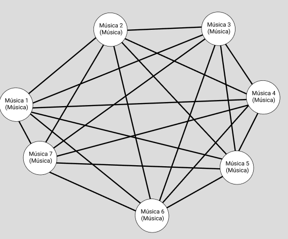

# Modelo para Apresentação do Lab08 - Modelo Lógico e Análise de Dados em Grafos

Estrutura de pastas:

~~~
├── README.md  <- arquivo apresentando a tarefa
│
└── images     <- arquivos de imagem usados na tarefa
~~~

# Equipe `Time 7` - `Time7`
* `Vitor Rodrigues Pietrobom` - `245584`
* `<nome completo>` - `<RA>`
* `<nome completo>` - `<RA>`

## Modelo Lógico Combinado do Banco de Dados de Grafos
> Tomamos como fator de mudança o objetivo de tornar o dataset mais simples e de fácil entendimento, para isso, resolvemos realizar uma operação de projeção baseado nos temas como fobia, filmes e personalidades para relacionar as músicas, estabelecendo assim relações medidas entre elas e deixando de depender das pessoas, podendo abrir mais o leque de datasets, de forma a transformar o banco de dados exclusivamente em um banco de dados de musica.
> Utilize este [modelo de base](https://docs.google.com/presentation/d/10RN7bDKUka_Ro2_41WyEE76Wxm4AioiJOrsh6BRY3Kk/edit?usp=sharing) para construir o seu.
> Coloque a imagem do PNG do seu modelo lógico como ilustrado abaixo (a imagem estará na pasta `image`):
>
> 

## Perguntas de Pesquisa/Análise Combinadas e Respectivas Análises

> Liste aqui as perguntas de pesquisa/análise combinadas e revisadas dos membros da equipe e respectivas análises.
>
### Pergunta/Análise 1
> * Quais as músicas que conseguem agradar o maior escopo de pessoas?
>   
>   * A análise necessária para obter esta resposta, seria uma com a modalidade centralidade, uma vez que com isso poderiamos identificar de forma clara as músicas com o maior número de relacionamentos e as músicas que tem menores caminhos para a maioria, uma vez que, quanto maior fosse esses números, mais proximos de outras músicas essas estariam, resultando assim num escopo maior de gostos 

### Pergunta/Análise 2
> * É possível recomendar musicas para pessoas se baseando em suas fobias e outras caracteristicas que não tem relação direta?
>   
>   * A análise necessária para obter esta resposta, sería uma com a modalidade comunidade, já que, ao agrupar os vertices em sub-grafos, seria possível avaliar se algum dos agrupamentos tem como caracteristica juntadora fobias, ou outras caracteristicas como altura ou mesmo sexo, facilitando muito essa identificação.

### Pergunta/Análise 3
> * Poderiamos prever o escopo que uma nova música alcançaria antes desta ser lançada?
>   
>   * Uma análise de predição de links auxiliaria em grande medida a tarefa de alcançar uma resposta para essa pergunta, uma vez que seriamos capazes de prever as relaçoes que essa música faria com outras músicas já presentes no banco de dados, possíbilitando assim identificar possíves qualidades ou defeitos desta.
